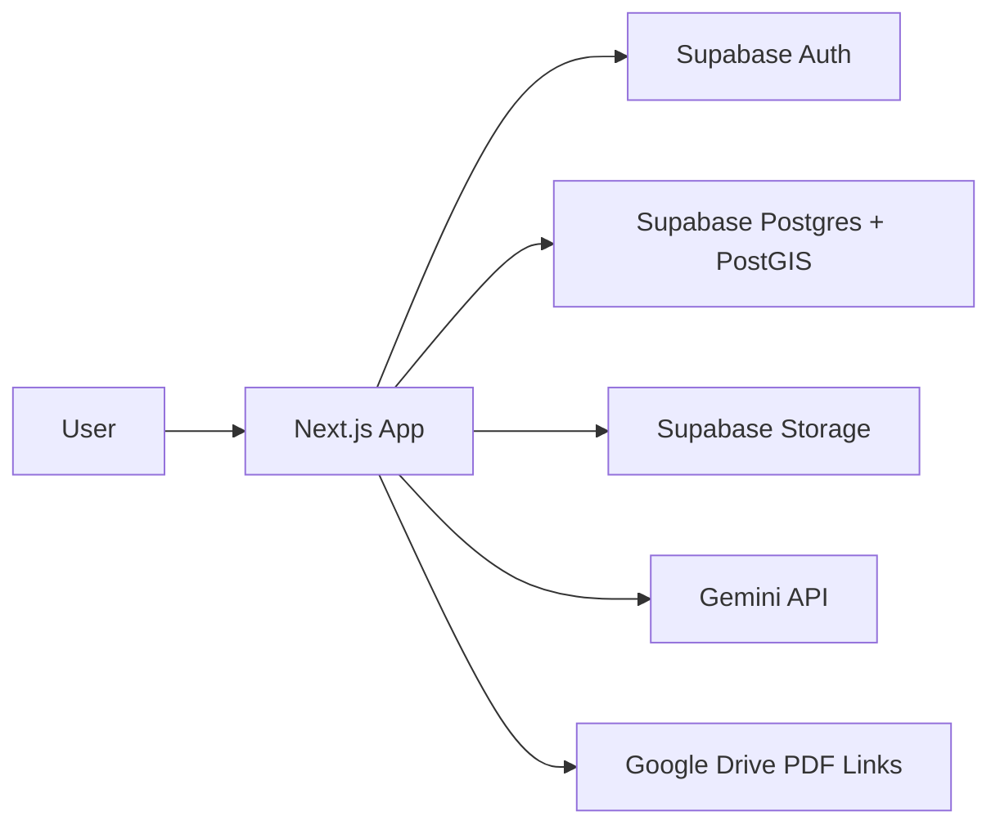

# アーキテクチャ

## 全体像

## データ正本

- 物件データの正本はSupabase Postgresです。
- Google Sheetsは初期移行元です。
- Google Drive PDFは移行期間中の参照元として `property_documents` にURLとfileIdを保持します。

## 主要テーブル

- `profiles`: ユーザー権限
- `properties`: 物件情報
- `property_documents`: PDFと物件の紐づけ
- `analysis_jobs`: PDF解析ジョブとAI抽出結果
- `audit_logs`: 作成、更新、承認などの監査ログ

## 認証と権限

Supabase Authのメール/パスワード認証を使います。新規ユーザーは `external_viewer` として作成され、管理者が必要に応じて `admin`, `editor`, `viewer` に変更します。

RLSにより、社外ユーザーは `properties.visibility = 'external'` の物件だけ閲覧できます。

## PDF解析

1. ユーザーがPDFをアップロードします。
2. PDFを `property-documents` bucket に保存します。
3. `analysis_jobs` を `processing` で作成します。
4. Gemini APIで物件情報をJSON抽出します。
5. 抽出成功時は `review_required` にします。
6. ユーザーがレビュー画面で修正・承認します。
7. `properties` に登録し、ジョブを `completed` にします。

Gemini呼び出しは同一プロセス内で直列化し、429/quota系エラーはリトライします。
