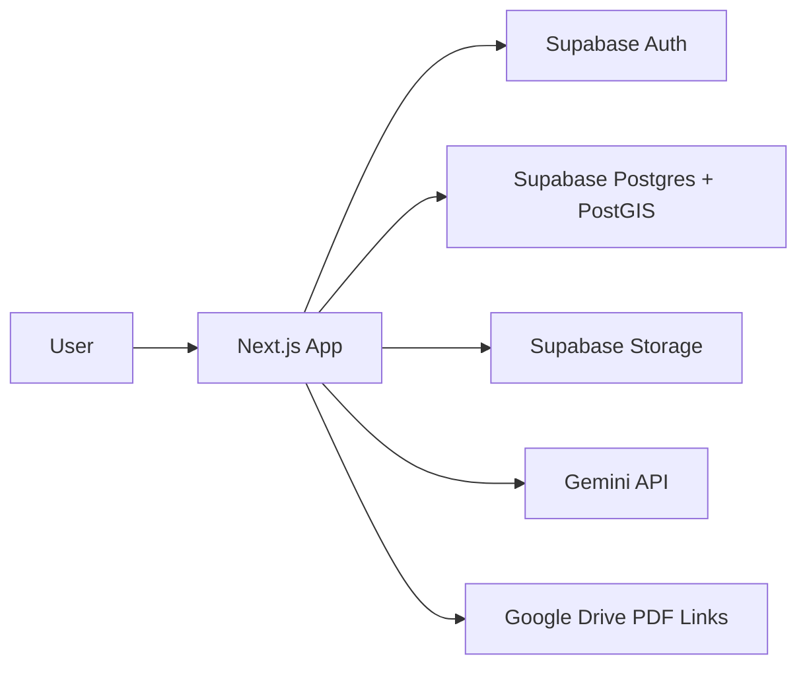

# アーキテクチャ

## 全体像

## データ正本

- 物件データの正本はSupabase Postgresです。
- Google Sheetsは初期移行元です。
- Google Drive PDFは移行期間中の参照元として `property_documents` にURLとfileIdを保持します。

## 主要テーブル

- `profiles`: ユーザー権限
- `properties`: 物件情報
- `property_documents`: PDFと物件の紐づけ
- `analysis_jobs`: PDF解析ジョブとAI抽出結果
- `audit_logs`: 作成、更新、承認などの監査ログ

## 認証と権限

Supabase Authのメール/パスワード認証を使います。ユーザーはログイン画面の「新規登録」からSignUpし、メール確認後にログインします。Supabase AuthのEmail providerと新規登録を有効化します。

ロールは `profiles.role` の `admin`, `editor`, `viewer`, `external_viewer` で表します。新規登録直後はデフォルトの `external_viewer` になるため、必要に応じて管理者が業務に必要な権限へ昇格します。

| ロール | 想定利用者 | 主な権限 |
| --- | --- | --- |
| `admin` | 運用管理者 | 全操作、権限変更、初期インポート、削除、監査ログ確認 |
| `editor` | 仕入担当者 | 物件登録/編集、PDFアップロード、AI解析、解析承認 |
| `viewer` | 社内閲覧者 | 社内物件を含む閲覧中心 |
| `external_viewer` | 新規登録直後または外部関係者 | 初期ロール/外部関係者向けの表示ラベル |

RLSはログイン済みユーザーを前提に緩和済みで、認証済みユーザーは物件閲覧、PDF参照、PDFアップロード、解析ジョブ作成、物件登録/編集に必要なアクセスを持ちます。`properties.visibility` は「社内限定」「社外可」の業務上の共有区分として保持し、ロール付与と共有可否の最終判断は運用で管理します。

## PDF解析

1. ユーザーがPDFをアップロードします。
2. PDFを `property-documents` bucket に保存します。
3. `analysis_jobs` を `processing` で作成します。
4. Gemini APIで物件情報をJSON抽出します。
5. 抽出成功時は `review_required` にします。
6. ユーザーがレビュー画面で修正・承認します。
7. `properties` に登録し、ジョブを `completed` にします。

Gemini呼び出しは同一プロセス内で直列化し、429/quota系エラーはリトライします。
